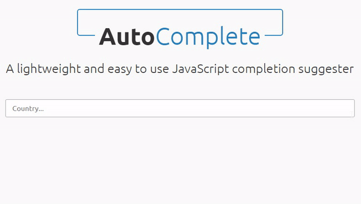

# Autocomplete

A lightweight and easy to use JavaScript completion suggester



## How to install

Add **autocomplete.js** and **autocomplete.css** files to your page(or **autocomplete.min.js** and **autocomplete.min.css**). You can change some of the styling in **autocomplete.css** to suit your needs.

## Usage

Create an **input** element with an **id** attribute:

```html
	<input id='input-country' type="text">
```

Initialize the autocomplete functionality on the input element using **Javascript**:

```javascript
	autoComplete({
		inputSelector : '#input-country',
		data: [
			'China',
			'Moroco',
			'USA',
			'Canada',
			'Thailand',
			'Russia',
			'Italy',
			'Germany',
			'Ukraine',
			'Turkey'
		]
	});
```
## Settings

| Property | Default | Description |
| :--- | :--- | :--- |
| inputSelector | blank string "" | Required a selector for text input field |
| data | [] | An array with suggestions |


## Change log

